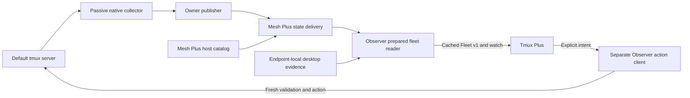

# Tmux Observer

Passive tmux observation and shared prepared views for local and remote clients.
The host-local core reads session metadata; an owner service publishes it.
A separate fleet reader uses Mesh Plus for state delivery and adds observations
from the viewing desktop. [Tmux Plus](https://github.com/byebyebryan/rofi-tmux-plus)
consumes those views and sends explicit intent to a separate action client.

## Current selection

As recorded on **2026-10-10**, Snap and Starship select:

| Component | Version | Responsibility |
| --- | --- | --- |
| Tmux Observer | **0.6.0a2** | Native facts, owner publication, prepared composition, desktop association and separate actions |
| Tmux Plus | **0.12.0a2** | Picker presentation, user intent and Tmux Session v1 compatibility CLI |
| Mesh Plus | **0.1.0a7** | Host catalog authority and reusable cached state delivery |

The [catalog bound-fix record](docs/evidence/2026-10-10-catalog-bound-fix/README.md)
binds exact artifacts and source/package/native, headless, resource/capacity and
managed recovery/paired rollback evidence. SDK a6 remains available for the
tested previous-tuple rollback. The
[managed operations ledger](https://github.com/byebyebryan/dotfiles/blob/main/docs/tmux-observer-operations.md)
owns installed selection; [implementation status](docs/implementation-status.md)
and the [Mesh integration ledger](docs/mesh-integration.md) retain checkpoint history.

These are recorded acceptance scopes. Graphical input/presentation and physical
suspend were optional and unrun for the Mesh wiring releases; earlier graphical
evidence retains its original artifact and endpoint scope.

## Component map



The owner exports only its own host. Each desktop has its own prepared reader;
UI clients share that reader's upstream connections. Mesh delivers state,
Observer validates native facts and joins independent desktop receipts, and
Plus chooses labels, views, ordering, selection and confirmations. Refresh
uses a separate bounded Observer control path. Actions independently validate
the current route and complete target; cached presence grants no action authority.
See [runtime architecture](docs/runtime-architecture.md) for package and process boundaries.

## Use the read interfaces

Examples use `snap` as a configured logical host ID. Substitute your endpoint's
Mesh local ID. Python 3.11+ is required; native/service support targets Linux.
From this checkout, run an explicit fresh local read:

```sh
uv run tmux-observer collect --host-id snap
uv run tmux-observer collect --host-id snap --panes --option @example
```

`collect` reads the configured default tmux server. It starts no service,
attaches no client and creates no server or session. It emits metadata only.

The owner publisher is an explicit, long-running operation. Run it separately
before querying its prepared state:

```sh
uv run tmux-observer owner --host-id snap --local-attachments
```

In another terminal, these operations read the running owner:

```sh
uv run tmux-observer status --expected-host snap
uv run tmux-observer snapshot --expected-host snap
uv run tmux-observer watch --expected-host snap
```

A fleet reader needs the configured Mesh authority, a `tmux_default` source
on each participating host and already running owners. The selected backend
is explicit:

```sh
uv run --extra mesh tmux-observer-client fleet --host-id snap --transport mesh
```

In another terminal with the same desktop environment:

```sh
uv run tmux-observer-client context
uv run tmux-observer-client snapshot --access cached --expected-host snap --json
uv run tmux-observer-client watch --expected-host snap --json
```

Cached reads and subscriptions start neither services nor native collection.
Missing, warming, failed and incompatible services return explicit states;
they never fall back to a fresh read. The generic fleet CLI defaults to
`legacy`; managed selection passes `--transport mesh` explicitly.

Fresh fleet diagnosis remains a separate operation, returning Tmux Session v1:

```sh
uv run tmux-observer-client snapshot --access direct --json
```

Explicit passive refresh returns a scoped ticket. Use the reply's fleet
publisher and ticket IDs for lookup:

```sh
uv run tmux-observer-client refresh --source snap:owner --source snap:desktop --json
uv run tmux-observer-client refresh_status --publisher-id UUID --ticket-id UUID --json
```

Package installation does not install or enable user units. Deployment captures
desktop context and starts services explicitly; see [service contexts](docs/service-contexts.md)
and [Mesh source configuration](docs/mesh-integration.md#candidate-rollout).

## Develop and read further

```sh
uv run --extra dev ./scripts/check
uv run --extra dev --extra mesh python scripts/check-mesh
```

The first command is the source/contract/lint gate. The second adds separate
Mesh integration checks. Native probes use owned disposable resources.
Package, installed, resource, graphical and recovery acceptance keep their own gates.

The pure native API is `tmux_observer.native`; `tmux_observer.public` retains
the compatibility facade. Prepared reads use `tmux_observer_client.public`.
Actions use `tmux_observer_actions.public` independently of observation services.

Start with the [documentation index](docs/README.md), [runtime architecture](docs/runtime-architecture.md),
[wire contracts](docs/wire-v1.md) and [action/desktop contracts](docs/boundary-wire-v1.md).
The [original architecture](docs/architecture.md), [first-delivery backlog](docs/implementation-backlog.md)
and historical acceptance records preserve their original decisions and scope.
Native control-mode events and physical sleep/wake remain optional follow-ups.
