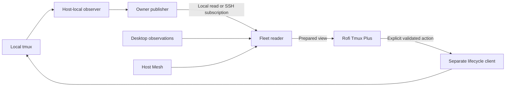

# Tmux Observer

Shared observation foundation for local and remote tmux clients.
Tmux Observer publishes host-local session metadata through a passive direct
collector and shared owner service. The prepared fleet service has passed
two-host awake/native and simulated recovery acceptance for always-on hosts.
Rofi Tmux Plus consumes its prepared views and retains presentation policy.

The implemented extraction follows the reviewed
[component boundaries](docs/component-boundaries.md) and
[source review](docs/component-boundaries-review.md): native tmux facts,
networking, desktop association, action clients and UI retain separate authority.
The accepted [0.4.0a1 fleet performance pass](docs/fleet-performance-design.md)
records reduced fleet bookkeeping, measured resource use and paired managed
deployment with Tmux Plus 0.10.0a2 on Snap and Starship.
The [0.3.0a1 local performance release](docs/tmux-observer-0.3.0a1.md) records
attachment-driven Kitty retention and separate native/resource evidence.
The [0.2.0a1 release record](docs/tmux-observer-0.2.0a1.md) names the frozen
artifact, [executable contracts](docs/boundary-wire-v1.md), native/action,
consumer and resource acceptance. Publication and scoped managed recovery/paired
rollback acceptance also pass as independent gates in the
[implementation ledger](docs/boundary-implementation.md).

## Status

Observer **0.6.0a2**, Tmux Plus **0.12.0a2** and Mesh **0.1.0a7** are released
and selected on Snap and Starship. The [accepted catalog bound fix](docs/evidence/2026-10-10-catalog-bound-fix/README.md)
records exact package/native, headless, resource/capacity and installed
recovery/rollback evidence. The library catalog now parses the same descriptor's
bounded bytes, closing growth and pathname-replacement races. SDK a6 remains
available for the independently tested previous-tuple rollback.
The [integration ledger](docs/mesh-integration.md) retains earlier candidates,
their acceptance limits and the previous rollout's evidence.

Deliveries A–E accepted in their recorded scopes, 2026-10-08; see the
[status record](docs/implementation-status.md). Pure contracts and the direct
collector and owner service passed isolated native/artifact acceptance.
Fleet/read acceptance has passed for the [always-on scope](docs/always-on-acceptance.md).
Physical sleep/wake is optional and unverified. Frontend migration and scoped
managed deployment passed separate installed/native gates on Snap and Starship;
the first delivery's graphical scope is recorded there. The subsequent boundary
delivery passes Snap graphical checks while Starship is in active use. Lifecycle
extraction is implemented in a separate UI-neutral action package. Native tmux
event experiments remain an optional follow-up.

```sh
uv run tmux-observer collect --host-id snap
uv run tmux-observer collect --host-id snap --panes --option @example
uv run tmux-observer owner --host-id snap
uv run tmux-observer snapshot --expected-host snap
uv run tmux-observer refresh --expected-host snap
uv run tmux-observer refresh_status --expected-host snap --publisher-id UUID --ticket-id UUID
uv run --extra dev ./scripts/check
uv run --extra dev python scripts/accept-native-collector --output /tmp/tmux-observer-native.json
```

`collect` is a fresh read of the default server. It does not start a service,
attach a client or create a server/session. Use a configured logical Host Mesh ID.
The pure Python API is `tmux_observer.public`; it imports no native collection,
networking or lifecycle code. Wire schemas and semantic rules are documented in
[wire v1](docs/wire-v1.md). The independent development reader is
`scripts/read-contract --schema observation` (JSON record on stdin).

`owner` explicitly runs the publisher. `status`, `snapshot`, `probe` and `watch`
read prepared state; missing services produce typed failure without activation.
`bridge` exports only that owner over stdio and accepts bounded requests on stdin.
`refresh` returns a bounded ticket; `refresh_status` reads its retained outcome.
Package installation alone does not install or enable the packaged user unit.
The accepted managed selection explicitly enables owners and starts desktop readers.

The separate client CLI has explicit fresh and prepared paths:

```sh
uv run tmux-observer-client snapshot --access direct --json
uv run tmux-observer-client context
uv run tmux-observer-client fleet --host-id snap
uv run tmux-observer-client snapshot --access cached --expected-host snap --json
uv run tmux-observer-client watch --expected-host snap --json
uv run tmux-observer-client refresh --source snap:owner --source snap:desktop --json
uv run tmux-observer-client refresh_status --publisher-id UUID --ticket-id UUID --json
```

`fleet` explicitly starts the per-context service. Its fixed local ID must match
Host Mesh. Remote owners must already be running at the selected installed owner
bridge path. Cached snapshot/status/probe/watch and ticket lookup use the private
fleet endpoint; they never activate services or fall back to direct collection.
Fresh inventory retains Tmux Session v1, while prepared operations return Fleet v1
frames. Desktop absence or unsupported contexts leave viewer membership unknown
without changing owner attachment facts. The packaged fleet unit and explicit
desktop environment handoff are documented in [service contexts](docs/service-contexts.md) and [two-host acceptance](docs/native-fleet-acceptance.md).
Installed/native acceptance and scoped managed rollout have passed separately;
the exact managed tuple and recovery/rollback evidence are linked in the status record.

The selected Mesh backend retains that same prepared endpoint and Fleet v1 facade:

```sh
rtk proxy uv run --extra dev --extra mesh python scripts/check-mesh
rtk proxy uv run --extra mesh tmux-observer-client fleet --host-id snap --transport mesh
```

Mesh Plus must expose its public `mesh-plus` authority and bridge command, with
the configured `tmux_default` source pointing to the already running owner.
Cached reads never start either service. Explicit refresh uses a bounded
Observer control request; fresh inventory and actions keep their independent
validation. Missing or incompatible Mesh delivery fails explicitly. See the
[candidate rollout](docs/mesh-integration.md#candidate-rollout) for source
configuration, exact package selection and rollback.

The extraction baseline is released `rofi-tmux-plus 0.6.0`, source
`407ae58ba422ba88fed7da2f9d845ff274830f0e`. Its public Tmux Session v1 and
Host Mesh v1 behavior must remain compatible during migration.

## Read the design

| Document | Purpose |
| --- | --- |
| [Component boundaries](docs/component-boundaries.md) | Current ownership decisions, contract domains and next extraction sequence |
| [Component boundary review](docs/component-boundaries-review.md) | Source findings, adversarial cases and remaining implementation gates |
| [Local performance design](docs/local-performance-design.md) | Next-pass attachment-driven Kitty associations, accepted limitations and measurement plan |
| [Fleet performance design](docs/fleet-performance-design.md) | Change-driven fleet facts, independent leases, proof scheduling and remote viewer review |
| [Architecture](docs/architecture.md) | Ownership, process topology, extraction and decisions |
| [Observation contract](docs/observation-contract.md) | Identity, facts, coverage, clocks and uncertainty |
| [Service and networking](docs/service-and-networking.md) | Cached reads, subscriptions, SSH, refresh and recovery |
| [Implementation plan](docs/implementation-plan.md) | Work packages, dependencies, acceptance and rollout |
| [Implementation backlog](docs/implementation-backlog.md) | Concrete tasks, owned paths, delivery order and first implementation pass |
| [Validation plan](docs/validation-plan.md) | Independent producer, transport and frontend proof |
| [Candidate artifacts](docs/candidate-artifacts.md) | Committed-source builds, exact manifests and acceptance boundaries |
| [Design review](docs/design-review.md) | Findings, resolutions, adversarial scenarios and pending gates |
| [Context and sources](docs/context-and-sources.md) | Checked baselines, measurements and primary references |

## Intended boundary



The owner publisher never aggregates remote hosts. The fleet reader combines
owner facts and observations from its own desktop; it never exports its fleet
view as a remote owner's inventory. Host Mesh owns host identity and routes.
Neither observation nor cached presence grants authority to focus, attach,
close, create, rename or kill a session.

## Intended delivery order

1. Define the contract and extract bounded local observation.
2. Independently accept the standalone producer and shared owner service.
3. Add a separate fleet reader, SSH transport and desktop observation adapter.
4. Migrate Rofi reads and correct completion feedback after producer acceptance.
5. Publish and deploy accepted prepared reads through scoped chezmoi changes.
6. Independently extract lifecycle implementation and preserve the old CLI facade;
   the boundary delivery implements this after the accepted read-service rollout.

Native tmux event collection is a later optional checkpoint. Initial local
collection is polling; local and SSH subscribers still receive published views
without each subscriber running a collector. Delivery push and native event
observation are separate capabilities.

## Current implementation

Deliveries A–E/T01–T15 are complete in the recorded always-on two-host scope;
[implementation status](docs/implementation-status.md) links their separate
acceptance. The original backlog remains the first-delivery baseline. T16 action
extraction is refined by [B0–B5](docs/component-boundaries.md#next-implementation-sequence),
including native attachment associations and desktop contract cleanup. T17 native
event collection remains optional. B0–B4 and the frozen native/resource/consumer
gates pass; B5 publication and managed selection are complete in the recorded
always-on two-host scope.
