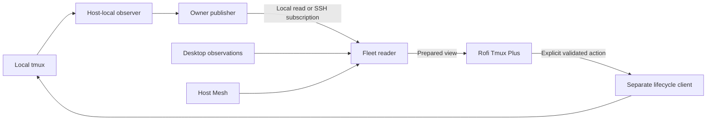

# Tmux Observer

Proposed shared observation foundation for local and remote tmux clients.
Tmux Observer will publish session identity, owner inventory, attachment facts,
observation health and freshness without owning tmux session lifecycle.
Rofi Tmux Plus will consume its prepared views and retain presentation policy.

## Status

Implementation in progress, 2026-10-07; see the
[status record](docs/implementation-status.md). Packaging/check foundations exist;
no observation API, running service or deployment has been accepted yet. Command
names, wire fields and initial resource settings below are proposed interfaces.
Implementation must pass the gates in the plan before these become supported
behavior. The review records design decisions and remaining native proof;
it does not certify runtime acceptance.

The extraction baseline is released `rofi-tmux-plus 0.6.0`, source
`407ae58ba422ba88fed7da2f9d845ff274830f0e`. Its public Tmux Session v1 and
Host Mesh v1 behavior must remain compatible during migration.

## Read the design

| Document | Purpose |
| --- | --- |
| [Architecture](docs/architecture.md) | Ownership, process topology, extraction and decisions |
| [Observation contract](docs/observation-contract.md) | Identity, facts, coverage, clocks and uncertainty |
| [Service and networking](docs/service-and-networking.md) | Cached reads, subscriptions, SSH, refresh and recovery |
| [Implementation plan](docs/implementation-plan.md) | Work packages, dependencies, acceptance and rollout |
| [Implementation backlog](docs/implementation-backlog.md) | Concrete tasks, owned paths, delivery order and first implementation pass |
| [Validation plan](docs/validation-plan.md) | Independent producer, transport and frontend proof |
| [Design review](docs/design-review.md) | Findings, resolutions, adversarial scenarios and pending gates |
| [Context and sources](docs/context-and-sources.md) | Checked baselines, measurements and primary references |

## Intended boundary

The owner publisher never aggregates remote hosts. The fleet reader combines
owner facts and observations from its own desktop; it never exports its fleet
view as a remote owner's inventory. Host Mesh owns host identity and routes.
Neither observation nor cached presence grants authority to focus, attach,
close, create, rename or kill a session.

## Intended delivery order

1. Define the contract and extract bounded local observation.
2. Independently accept the standalone producer and shared owner service.
3. Add a separate fleet reader, SSH transport and desktop observation adapter.
4. Migrate Rofi reads and correct completion feedback after producer acceptance.
5. Publish and deploy accepted prepared reads through scoped chezmoi changes.
6. Independently extract lifecycle implementation and preserve the old CLI facade
   as a separate follow-up; it need not delay the read-service rollout.

Native tmux event collection is a later optional checkpoint. Initial local
collection is polling; local and SSH subscribers still receive published views
without each subscriber running a collector. Delivery push and native event
observation are separate capabilities.

## Next concrete action

Begin G0 in the [implementation plan](docs/implementation-plan.md): turn the
reviewed semantics into strict schemas, raw-wire fixtures and an independent
reader, then pin the extraction baseline. Do not start by moving whole modules
or changing the managed Rofi launcher.

The first implementation batch is [Delivery A, T01–T05](docs/implementation-backlog.md#delivery-a-first-implementation-pass):
package/provenance, executable contracts, an independent reader, direct collector
and native producer acceptance. The backlog specifies the remaining dependencies.
