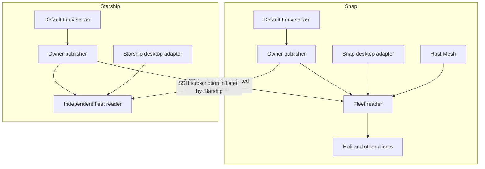

# Architecture

For the selected Mesh-backed implementation, start with
[current runtime architecture](runtime-architecture.md). This document preserves
the original extraction design; its command names and source map are historical.

Date: 2026-10-07. Status: original reviewed first-delivery design. Its problem
statement and extraction map describe the pre-extraction Tmux Plus 0.6.0 baseline.
Deliveries A–E subsequently passed their recorded acceptance; see
[implementation status](implementation-status.md) and [wire v1](wire-v1.md).
The [2026-10-08 component boundaries](component-boundaries.md) govern the next
ownership refinement, with a separate [source review](component-boundaries-review.md).
This baseline is not a new implementation or a second current runtime ledger.

## Problem and intended behavior

Rofi Tmux Plus currently owns observation, SSH inventory, private caches,
desktop viewer inspection, refresh coordination, lifecycle and presentation.
Opening the picker may start finite collection. The recorded healthy remote
jobs take roughly 0.5–1 second, while the displayed refreshing state can persist
longer because completion is adopted through an inactivity callback.

The target is a prepared local view that multiple clients can query without
running native collection or opening SSH at query time. Rofi restores the saved
view and exact remembered reference, reads that view and renders. Collection
continues independently of a picker window. Missing or stale data remains
explicit. A reader outage does not silently trigger synchronous collection.

Tmux Observer remains useful without Agent Observer, Agent Plus, Rofi, a desktop
compositor or SSH Plus. Its domain is tmux metadata; attached does not mean an
agent is working, and detached does not establish task completion.

## Components and import boundaries

| Component | Owns | Excludes |
| --- | --- | --- |
| `tmux_observer.public` | Pure models, schemas, parsers, semantic validation, reference and receipt rules | Native commands, services, SSH and actions |
| Local collector | Bounded default-server reads, metadata, complete/failed coverage, server incarnation checks | Starting/attaching sessions or managing tmux |
| Owner service | One fixed host/user/server scope, scheduling, shared samples, snapshot/watch, refresh hints, health | Remote routing and desktop aggregation |
| First-party owner read CLI | Explicit direct reads or explicit service access, diagnostic output, stdio bridge | Hidden service start, collection fallback or native actions |
| Fleet/read service | Host Mesh validation, SSH owning-host reads/subscriptions, fleet view, transport recovery | Acting on tmux or exposing an aggregate as an owner source |
| Desktop adapter | Bounded local viewer observations joined to accepted owner references and selected routes | Focus, verified close handles, raw captures or provider semantics |
| Lifecycle/write client | Exact-target revalidation, focus/attach/create/rename/kill/verified close | Authority from a cached observation or observation-service dispatch |
| Rofi Tmux Plus | Intent, scopes, ordering, filter, selection, bookmarks, confirmation and protocol rendering | Native/process/desktop collection and SSH observation loops |

Use Python 3.11+ on Linux and the existing bounded read/parsing implementation
initially. Pure wire validation is platform-independent; supported native/service
platforms require their own clock and passivity acceptance.
Proposed package names express boundaries, not a decision to publish several
distributions immediately. One repository/distribution can contain separately
testable modules and entry points. Core/read installation acquires no mandatory
frontend, provider-runtime or terminal-launch dependency. Pure consumer validation
imports no collector, service, networking or write implementation.

## Runtime topology

The initial implementation uses two explicit roles:

1. One **owner publisher** per user/host/default-server scope.
2. One **fleet reader** per user/desktop context serving local UI consumers.

A headless remote host needs only the owner publisher. A desktop that both owns
tmux sessions and browses the fleet runs both roles. This separation permits
different environment and lifecycle requirements, keeps remote exports local,
and gives owner and networking acceptance independent gates. Co-locating the
roles in one process is deferred unless measured overhead warrants it.

Each fleet reader reads its local publisher over a private Unix socket. Its
networking component reaches peer publishers through the authoritative SSH
routes. The remote command bridges a local owner service to stdin/stdout; it
does not recursively invoke a fleet reader. No new TCP listener or reverse
connection to the desktop is required.

The fleet reader is shared across local read clients. Client count must not
multiply owner sampling, desktop scans, SSH subscriptions or Host Mesh polling.
Each configured remote has at most one active owner subscription per fleet
reader, on one selected route. Two active desktops may have opposite-direction
subscriptions; those are separate views, not a cross-host replication protocol.

## State and ownership

Tmux itself owns sessions and native client attachments. Owner observations
describe those facts. The observer does not own their lifetime. The fleet reader
owns transport associations and its aggregate; a desktop adapter owns only
observations for its captured desktop context. Rofi owns presentation state.

An owner publisher never receives arbitrary remote owner rows to classify.
The desktop adapter runs in the fleet reader, where accepted owner facts and
selected routes are available. This is necessary for the existing qualified
manual-SSH viewer rules and avoids adding remote inputs to a host-local core.
The adapter retains an independent receipt and invalidates affected matches
when relevant owner inputs or desktop context change.

Rofi's content-addressed presentation snapshot remains private UI state. It is
not the observation cache, authority for a native action or proof of current
presence. Pending confirmations retain their exact target; a newer observed
view never retargets an outstanding destructive confirmation.

## Read and refresh behavior

Direct collection is explicit and available for diagnosis without any service.
Cached snapshot/watch access fails explicitly if its selected publisher is
absent or incompatible. Reads never create a publisher and never fall back to a
costly direct collection. Managed units are started as an operational choice.

Scheduled collection normally produces quiet view updates. An explicit refresh
hint is separately rate-limited and coalesced; it changes collection scheduling,
not tmux state. Cached readers/subscribers cannot choose native paths, server
scope, collector options, polling cadence or execute an action. Refresh tickets
bind a fixed source scope and service incarnation. See the
[service design](service-and-networking.md) for completion semantics.

`Alt+R` requests passive reconciliation without changing Rofi's filter, action
or selected reference. It must not reuse a generic boolean that treats every
periodic desktop scan as a user-visible refresh. Post-action reconciliation
remains scoped to the affected owner and cannot retry the native action.

## Initial observation and push strategy

Start with bounded polling of the local tmux server, shared by all subscribers.
Local and SSH clients receive new accepted views; the delivery interface is push
even though the native source is sampled. Advertise that distinction explicitly.

Native tmux control mode is a later source-adapter experiment. A control client
can attach to a session. The experiment must independently demonstrate no
change to attachment reporting, session lifetime, last-attached behavior or
window geometry. Suppressing pane output does not prove passivity. A design
that merely subtracts the observer's client from a displayed count is insufficient.
If passive observation cannot be established, retain the sampled source adapter.
See [primary references](context-and-sources.md#primary-references).

## Extraction strategy

The source baseline already contains useful logic but not clean module boundaries:

- `tmux.py` mixes default-server inventory, reference lookup and mutation methods.
- `lifecycle.py` owns local inventory alongside actions and terminal launch.
- `viewer_service.py` mixes bulk display observations with focus and verified close.
- `inventory_service.py` mixes Host Mesh composition and local collection.
- `picker_model.py` owns finite refresh scheduling and caches used by Rofi.
- `config.py` mixes cadence settings with terminal and attach configuration.

Extract narrow read interfaces and pure shared types. Do not transfer whole
modules with writable methods into the passive core. Preserve fast/legacy parser
behavior and raw-wire bounds, and explicitly audit read consistency and server
replacement races. Correct producer defects in independently accepted producer
checkpoints rather than masking them in a frontend.

The source map and work ownership are in the
[implementation plan](implementation-plan.md#extraction-map).

## Compatibility and lifecycle migration

The released Tmux Session v1 contract is owned by the existing
`rofi-tmux-plus` executable. It covers inventory and lifecycle; it cannot simply
be renamed to an Observer observation contract. Keep its canonical bundle and
argv/JSON/exit behavior unchanged during this migration.

Initially its inventory facade delegates to accepted direct observation and
fleet composition with equivalent fresh-read semantics. Its explicit lifecycle
implementation can remain in the existing repository while read migration
proceeds. Later a separately accepted first-party write client can own generic
actions; the old executable remains a compatibility facade. Rofi eventually
contains UI and client-facing action intent, not copied lifecycle internals.

New observer, service and fleet contracts use distinct version identifiers and
explicit cached access. Existing live inventory is not silently mapped to a
retained service snapshot. Agent Plus continues using the old facade until a
separate consumer migration. Agent Observer is not modified by this extraction.

## Operational model

Owner publisher configuration fixes logical host scope and tmux executable at
startup. Subscriber input cannot relabel the owner. Default-server observation
is the only supported source initially; alternate sockets/profiles are deferred.
Host Mesh identity is passed through deployment configuration, not inferred from
a native hostname. Returned provenance is validated against the selected route.

Owner services need no desktop environment. Fleet/desktop services capture the
desktop environment separately and invalidate its context on compositor/socket
replacement. Service restart affects only owned observer/SSH children, never tmux
servers, session clients, terminal windows, Agent Observer or provider runtimes.

Retain last-known metadata for diagnosis/outages with its original provenance
and age. A persisted cache is stale after publisher restart until accepted new
collection; it cannot carry a current lease into a new service incarnation.

## First-delivery decisions

| ID | Decision |
| --- | --- |
| D01 | Separate passive host core, owner service, fleet/desktop reader, lifecycle and UI. |
| D02 | Two explicit service roles initially; no distributed owner-to-owner replication. |
| D03 | Default-server scope only; no server/session creation or attached observer client. |
| D04 | Explicit direct versus cached access; no hidden fallback or service activation. |
| D05 | Full replacement views, bounded fan-out, gap/resync and incarnation-aware readers. |
| D06 | Separate source receipts; receiving data or a heartbeat renews no native evidence. |
| D07 | SSH-only remote transport through Host Mesh, with explicit remote-age proof. |
| D08 | Bounded explicit refresh hints, independent of subscriptions and native actions. |
| D09 | Preserve Tmux Session v1 facade before extracting write implementation. |
| D10 | Native source events, HTTP/TCP export and process co-location are later checkpoints. |
| D11 | Producer acceptance precedes frontend migration and managed selection. |
| D12 | Rofi continuous-interaction refresh behavior requires a native frontend gate. |

This original design did not itself accept native passivity, SSH lease correctness,
service resource settings, graphical latency or deployment. Subsequent evidence
is recorded in implementation status, not retroactively attributed to this design.
New extraction work retains the separate gates in component boundaries.
