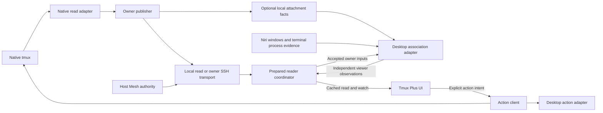

# Component boundaries and next extraction

Reviewed: 2026-10-08. Status: design decisions for the next extraction, not a
new API, implemented write client or runtime acceptance. The companion
[review](component-boundaries-review.md) records source evidence, risks and gates.
The accepted first delivery remains in [implementation status](implementation-status.md).
Published Observation 1, Service 1, Fleet 1 and Tmux Session v1 remain unchanged.

This document governs the next ownership refinement. The original
[architecture](architecture.md) remains the first-delivery design and topology;
its extraction baseline must not be mistaken for today's implementation.

## Ownership

Tmux owns sessions and native attachments. Observer reports native facts.
Networking carries and composes observations. Desktop adapters establish local
viewer associations. Action clients act on independently validated targets.
Tmux Plus owns presentation and user intent. None of these observations describes
an agent's work state or establishes provider lifecycle authority.

| Boundary | Owns | Excludes |
| --- | --- | --- |
| Pure tmux contract | Session references, native metadata shapes, coverage, native fact validation | Fleet catalog, compositor fields, action requests and native execution |
| Native read adapter | Bounded reads of the configured default server, generation/identity brackets, optional native attachment associations | Attaching a client, creating a server, modifying options/hooks, terminal inspection or SSH |
| Owner service | Fixed source configuration, shared scheduled samples, receipts, snapshot/watch and bounded passive refresh hints | Meshing, desktop scans and native actions |
| Networking | Host Mesh consumption, owner-only SSH subscriptions, source/route validation, conservative remote receipt translation and recovery | Native collection, desktop matching, host registry ownership and write dispatch on read streams |
| Prepared reader coordinator | Shared owner aggregation, optional desktop jobs, dependency invalidation, cached view/watch and scoped refresh completion | UI policy, implicit direct fallback and lifecycle actions |
| Desktop observation adapter | Niri window reads, bounded terminal/process evidence, matching against accepted native references/associations | Native tmux collection, SSH collection, focus, launch and close |
| Action client | Independent target validation, local native actions, routed execution, terminal launch and desktop action adapters | Observer-service action dispatch or permission derived from cached presence |
| Tmux Plus | Labels, ordering, view membership, filter, selection, bookmarks, frozen confirmations and user-visible outcomes | Native/session/window/process discovery, transport loops and copied lifecycle implementation |

The owner service wraps the native core; it does not expand its domain.
The prepared reader is composition glue, distinct from its transport and desktop
adapters. Co-location in one process is acceptable. Keep the current owner and
per-context reader topology initially; no daemon or repository per table row is
required. Package boundaries and public contracts, rather than process count,
enforce ownership. A headless owner requires neither Niri nor networking.

The attachment-fact arrow is a scheduled, receipt-bearing read interface, not a
second collector started by a viewer scan. The UI's separate Refresh request
hints bounded reconciliation in the reader/owner; it is not a native action.

## Contract ownership

There are five logical contracts. C1/C2 initially remain the existing owner
observation/service layers. C3 and C5 require extraction work; the identifiers
below name responsibilities, not implemented wire versions or proposed commands.

| Contract | Input | Output and authority |
| --- | --- | --- |
| C1: native observation | Fixed owning host/user/default-server configuration; explicit bounded read profile | Full native references and metadata, coverage and observation provenance; no desktop presence or action handles |
| C2: owner delivery | Expected source, supported read/watch/probe operations, separate explicit refresh hint | Publisher/clock incarnation, ordered delivery and source receipts; a heartbeat proves transport only |
| C3: desktop association | Accepted owner references/receipts, selected route evidence, optional local native client associations and one captured desktop context | Per-reference presence, evidence class, confidence/reason and desktop receipt; no operation handle |
| C4: prepared read | Explicit reader/context and expected host, cached snapshot/watch or scoped refresh/ticket lookup | Validated per-owner projections, catalog/transport health and optional desktop observations; no action authorization |
| C5: explicit action | Operation, owning-host scope, exact target where applicable, operation-specific guards and presentation policy | Independently validated action result, separating native effect from viewer/transport outcome |

Keep contract validation side-effect-free and consumer-installable. The native
public facade must not acquire fleet, Niri or write-domain definitions merely
because their validators are pure. Shared strict framing and generic clock
utilities can live below all contracts. Routing and desktop validators belong
to their own facades; prepared consumers import neither collectors nor transport
loops. Writes may use public read models, but read imports never acquire writes.

Do not change existing schema files or reinterpret existing confidence fields in
this documentation pass. Before implementation, freeze the exact C3/C5 and local
attachment shapes, extension policy, limits, errors and independent examples.
Breaking schema or semantic changes need explicitly versioned interfaces;
module extraction alone does not require a new wire version. Preserve the
existing public CLI through a deliberate compatibility projection.

## Native facts and optional client associations

The complete session identity remains
`(hostId, serverGeneration, sessionId, createdAt)`. Rename preserves it; server
replacement or identity reuse invalidates it. Host Mesh owns expected logical
host/route authority; native hostname is descriptive evidence. A subscriber
cannot relabel an owner or select another server through a reference.

Session creation, activity, last attachment, attached-client count, window count,
paths and selected-window metadata are native facts. Activity remains tmux's
activity timestamp, not agent progress or observation freshness. Wall-clock
labels and BOOTTIME leases remain separate.

The current `pending` field comes from `@rofi_tmux_plus_pending`. It is a
launch-client annotation read passively from tmux, not a universal native session
phase. Keep the legacy field in its compatibility projection. The refined core
contract should isolate such annotations in an explicit bounded extension/profile;
the launch client owns their meaning. No observation path repairs registration.

Move `desktop.LocalClients.client_pids_by_session` behind the native read
boundary. The preferred target is an optional host-local association profile
scheduled by the owner and consumed from prepared state. It may share a native
job, but its coverage, input dependencies and receipt must be explicit. Desktop
reads must not secretly schedule it. Default remote owner export needs no client
PID roster; detailed local associations are not a new global PID namespace.

Bind association facts to the full session reference, owning source, server
generation and local boot/PID namespace. Preserve the current 512-client bound
or reject explicitly; no silent truncation can prove client absence. The local
process adapter checks UID/process incarnation and bounded sampling consistency
before joining a native PID to a window. A numeric PID alone cannot establish a
stable viewer. Exact encoding and race guards are a B1 contract gate.

Failure or partial association coverage invalidates that join, not unrelated
session metadata. Explicit independent receipts prevent a fresh viewer scan from
renewing an old native association. Client switching and new associations must
participate in the desktop input signature; unchanged lease renewals need not
force another expensive desktop scan.

## Desktop association

“Niri adapter” names the first supported desktop implementation, not a promise
that compositor metadata alone identifies tmux sessions. Separate three roles
inside this implementation: compositor reads, terminal/process evidence and a
matching policy. No general plugin framework or other compositor support is
required by this pass.

The input is a bounded set of accepted owner references plus relevant names,
native hostnames, attachment evidence, selected routes and receipts. The adapter
captures one local desktop context and scans only that context. Window IDs are
compositor-local and may be reused. Context replacement invalidates the whole
association receipt even if IDs or titles look unchanged.

Publish bounded association evidence, not raw window captures, arbitrary process
environments, credentials or terminal contents. Window/process candidates stay
internal by default. A passive observation is never a verified focus/close handle.
An action client must obtain and revalidate its own current window target.

Presence remains `open`, `none` or `unknown`, with explicit confidence/reason:

- A current native attachment-to-window association can support strong confirmation.
- A unique title/owner match with live compatible process and attachment evidence
  supports qualified matching. Manual SSH shells remain useful in this category.
- A launch reference/argv describes the original attachment intent. It cannot
  alone prove the current session after that client switches sessions.
- Duplicate/conflicting candidates, unsupported context, incomplete scans and
  expired evidence remain unknown. `none` requires complete supported coverage.

The current legacy wire has its existing `confirmed`/`matched` rules, including
remote launch-reference confirmation. C3 must explicitly distinguish current
association proof from supported launch evidence. Stronger remote confirmation
requires an independently proved current end-to-end join; otherwise the refined
model uses qualified matching/unknown as appropriate. Do not add registration
writes, hooks or attached observer clients to obtain that proof.

## Networking and prepared composition

Consume the existing Host Mesh contract rather than creating a second registry.
Each remote connection exports only that owning host's publisher, never its
fleet or desktop view. Each prepared reader owns at most one selected owner
subscription per remote. Multiple UI clients share collection and transport.
Independent desktops can have opposite-direction subscriptions without
distributed fleet replication or reverse desktop connections.

Networking validates expected source, publisher/connection incarnation, route
revision, ordering and remote age proof. Arrival or a heartbeat cannot renew an
owner receipt. Cross-host BOOTTIME values are never directly subtracted. Keep
the accepted conservative probe-based expiry translation.

The coordinator joins independent facts and revokes dependent positives when
owner, route or desktop context changes. Unsupported desktop observation leaves
owner inventory usable. A complete-empty source, failed source, warming reader,
unavailable catalog and expired receipt remain distinguishable. Retained names
are historical metadata, not proof of current attachment.

Core and owner access work with no desktop. Networking logic requires no Niri;
the current Fleet 1 desktop envelope may remain unsupported when no adapter is
available. Decoupling the envelope from its implementation does not require an
immediate second headless protocol or reader daemon.

Collection stays scheduled independently of readers. Snapshot/watch/ticket
lookup start no service or collection. Explicit refresh has incarnation-bound,
bounded, coalesced tickets and terminal per-source outcomes. Post-action
reconciliation targets the affected owner and never retries an action.

## Action boundary and compatibility

Extract a UI-neutral action client under the Observer repository's separate write
boundary, as already planned by T16. Its local executor knows native tmux
operations. Its routing/presentation layer consumes Host Mesh and terminal/Niri
action adapters. Keep routed writes off owner/fleet read streams. No writable
method is exported by an observation daemon.

Open/rename/kill/inspection use the complete reference and fresh owning-host
validation. Create has no existing session reference: it uses explicit host,
name, cwd, command and bounded operation-specific inputs. Do not require an
inventory row for Create or infer its target from UI labels. Close-viewer and
Kill are different operations: close requires fresh verified viewer guards and
session-survival policy, not an Open observation or native attachment count.

Fresh action inspection does not depend on a prepared reader being healthy or
on finding a target in a capped displayed roster. Configuration selects the
native default-server source and terminal policy; UI read requests cannot choose
arbitrary paths or executable commands. An action cannot switch host or target
after its route/identity guards have been established.

Qualified presence may lead to successful best-effort focus. That result is not
stronger observation evidence. The refined action policy uses a uniquely
revalidated compatible candidate, never the first of duplicate titles; ambiguity
returns a bounded rejection unless a caller explicitly requests a new viewer.
Verified close still needs its stronger independent checks. An unavailable
desktop does not prohibit native-only create/rename/kill or an explicitly
supported terminal attachment route.

Separate native effect, local terminal spawn, completed attachment, focus and
transport certainty. The legacy `terminalLaunched` field means successful local
spawn, not completed remote attachment. A timeout after dispatch can have an
uncertain effect; no request ID or refresh ticket implies idempotency. Do not
automatically repeat Create, Kill, Close or terminal launch after an uncertain
result. Cleanup stops only owned launcher/transport resources and preserves
sessions/attachments that the client no longer owns.

The released `rofi-tmux-plus` executable remains a compatibility facade for
Tmux Session v1 inventory and lifecycle. Fresh inventory stays fresh; cached
reads stay explicit. Preserve argv/JSON/errors/exit semantics and verified-viewer
guards. The new duplicate-focus policy is an intentional behavioral tightening,
not a claim of exact old ordinary-Open parity. B4 must document its legacy mapping
and regression cases before switching the facade; do not silently combine that
correction with a supposedly behavior-identical extraction.

## UI ownership

Tmux Plus consumes C4 and C5. Open derives from current owner and desktop
evidence; Attached derives from current positive native attachment counts.
Unknown membership is not an empty roster. All/host views may retain historical
rows with uncertainty visible. Ordering and age formatting are UI policy.

Keep remembered view and last successfully opened complete reference in UI state.
Cursor movement, failed actions and cancellation do not overwrite the bookmark.
Confirmation retains its original exact target; updated observations never
retarget it. Cached browsing adopts current validated facts without collection
or action dispatch, preserving the accepted 0.7.0a2 renewal repair.

Rofi owns rendering, filter/caret and watcher lifetime. It owns no source scheduler,
SSH loop, native viewer scanner or lifecycle implementation. The legacy CLI is
a compatibility client, not evidence that all code in its distribution is UI.
Native Rofi ABI validation remains frontend installation policy.

## Next implementation sequence

| Step | Change | Acceptance boundary |
| --- | --- | --- |
| B0: contract freeze | Concrete C3/C5/local-association shapes, versions, semantic examples, legacy projections, dependency map | Independent valid/invalid examples and explicit compatibility deltas; no runtime promotion |
| B1: native association source | Move bounded local client reads into an optional native profile with coverage/receipts | Native switch/reuse/generation/partial cases, no attachment/lifetime/option changes; resource gate |
| B2: desktop extraction | Separate Niri reads, terminal evidence and matching; consume prepared native inputs | Local and remote matching, context replacement, ambiguity, failed association and headless owner isolation |
| B3: write client | Extract native executor, action routing and desktop/terminal action adapters | Independent exact-reference, effect/uncertainty, close and cleanup proof; callable without Rofi |
| B4: consumer/facade migration | Delegate CLI writes; remove active duplicated observation/lifecycle paths from frontend | V1 parity/delta corpus, remembered context, expiry, frozen confirmations and GUI acceptance |
| B5: artifact selection | Publish exact accepted inputs and scoped managed changes | Independent installed-byte, recovery, rollback and endpoint acceptance |

Dependency checks should prove pure owner/read imports with networking, desktop
and write implementations unavailable; networking with desktop unavailable;
prepared UI consumption with collector/transport implementations unavailable;
and actions without Rofi or an observation service. Do not remove a compatibility
path until its replacement has passed that path's own gate.

Keep current service caps and the accepted 96/768 MiB resource ceilings during
extraction. The prior normal Snap CPU profile was close to its 5% ceiling; adding
native association work needs a new bounded normal profile, not a faster default
poll to disguise stale joins. Cached latency, source lag, refresh-ticket completion
and visible UI adoption must be measured separately. Native event collection is
still optional T17 and requires its own passivity/benefit proof.

No implementation, native sessions, UI input, suspend, deployment or package
selection is part of this documentation pass. Later graphical acceptance uses
Starship; Snap remains reserved for active use. Physical sleep/wake remains an
optional follow-up to the accepted always-on scope.
