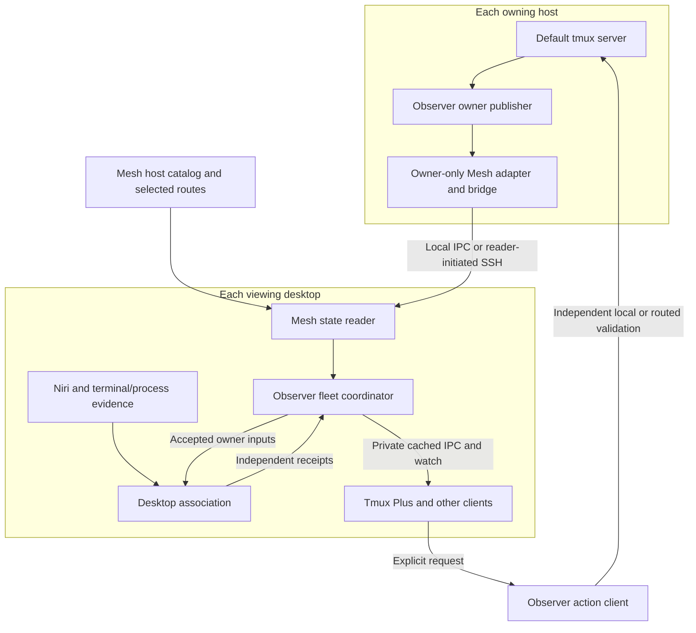

# Runtime architecture

Updated 2026-10-10 for Observer 0.6.0a2 / Tmux Plus 0.12.0a2 / Mesh 0.1.0a7.
This is the current component overview. The [original architecture](architecture.md)
and [boundary design](component-boundaries.md) retain the extraction history.
[Managed operations](https://github.com/byebyebryan/dotfiles/blob/main/docs/tmux-observer-operations.md)
and [accepted artifact evidence](evidence/2026-10-10-catalog-bound-fix/README.md)
own selection and acceptance.

## Who owns what

| Component | Package or repository | Responsibility |
| --- | --- | --- |
| Native contract and collector | `tmux_observer.native`, `collector`, `attachment_collector` | Full session identities and bounded passive default-server metadata reads |
| Owner publisher | `tmux_observer.owner`, `delivery` | Fixed host scope, scheduled samples, independent receipts, snapshot/watch and passive refresh hints |
| Networking and catalog | [Mesh Plus](https://github.com/byebyebryan/mesh-plus) | Logical hosts/routes, reusable local/SSH state delivery, proof and recovery |
| Mesh adapter and composition | `tmux_observer.mesh`, `tmux_observer_client.mesh_fleet` | Native-to-Mesh adaptation, guarded owner projection and existing Fleet v1 facade |
| Desktop association | `tmux_observer_client.desktop`, local bindings and desktop adapters | Endpoint-local Niri/terminal/process evidence joined to accepted native inputs |
| Prepared consumer facade | `tmux_observer_client.public`, `contract` | Cached queries/watch, context identity, source freshness and bounded refresh tickets |
| Action client | `tmux_observer_actions.public`, `contract` | Independent route/target validation, native lifecycle, terminal launch and window actions |
| UI and legacy CLI | [Tmux Plus](https://github.com/byebyebryan/rofi-tmux-plus) | Labels, views, filter, ordering, remembered context, confirmation and Tmux Session v1 compatibility |

These responsibilities do not require a process or distribution for every row.
Observer ships three package roots: core, client/composition and actions.
Pure contracts can be consumed without importing their native, transport or action
implementations. Action imports do not enter passive core/read paths.

## Process topology

A host publishes its own default server through one owner service. A desktop
runs a separate context-scoped fleet service; its Mesh reader and desktop work
are components of that service. A headless owner needs neither a compositor
nor a fleet reader.

Remote state exports only owner facts. It never exports another desktop's fleet
or viewer state. Multiple local clients share the fleet service's collection and
transport; separate desktops retain independent views. No reverse desktop
connection or cross-host fleet replication is involved.

The selected fleet uses Mesh's public configured reader and pure admission guard.
Observer retains native semantics, complete identities, original source receipts,
historical rows and the Fleet v1 projection. Loss, gaps or scope replacement
revoke positive facts until guarded current state returns.

## Three paths with different guarantees

| Path | Interface | What happens |
| --- | --- | --- |
| Explicit fresh read | `collect`; client `snapshot --access direct`; Plus `inventory` | Bounded native reads, with explicit fresh fleet composition where requested |
| Prepared read | Owner snapshot/watch; client `snapshot --access cached` and watch | Reads already published state; starts no service, collection or upstream connection in the UI client |
| Explicit action | `tmux_observer_actions.public`; Plus lifecycle CLI/picker intent | Revalidates the selected route and exact target independently before dispatch |

Explicit refresh is a fourth, narrow control operation: it hints bounded passive
collection and returns an incarnation-bound ticket. Mesh's frozen state surface
has snapshot, proof and subscribe; it has no refresh or lifecycle capability.
Observer therefore keeps refresh on a separate bounded owner control path.
Fresh inventory and action routing also retain their independent accepted paths.
See the [Mesh integration ledger](mesh-integration.md#scope-and-decisions).

The generic fleet command and packaged unit default to the `legacy` backend.
Current managed controls explicitly select `mesh` and source `tmux_default`.
A failed Mesh backend never silently chooses legacy or direct collection.
The retained a6 SDK and prior Observer/Plus tuple provide the tested rollback;
legacy remains an explicitly selectable backend.

## Identity, clocks and uncertainty

The complete target is `(hostId, serverGeneration, sessionId, createdAt)`.
A rename preserves identity. A replacement server or reused session ID does not.
Names, titles, paths and PIDs are evidence rather than replacement identities.

Owner facts, native attachment associations, desktop observations and transport
health have separate provenance and leases. A heartbeat or cached delivery
renews no source fact. Cross-host boot clocks are not directly comparable; Mesh
carries conservative remote freshness proof, which Observer validates before
projecting current native facts.

Scheduled native observation remains polling, normally every two seconds with
ten-second leases. Subscription push improves delivery; it does not introduce a
tmux control client or native event source. Stable local desktop associations can
be retained while their independent native inputs remain current; their original
discovery time is preserved and display confidence remains qualified.

A complete-empty sample can establish absence. A failed or partial sample cannot
prove that an omitted session was removed. Unknown, unsupported, stale, failed
and warming states remain visible. Retained metadata is useful for diagnosis and
All/host views; it supplies no current attachment or action authority.

## Contracts and safety

[Wire v1](wire-v1.md) defines Observation, Service and Fleet layers.
[Boundary wire v1](boundary-wire-v1.md) adds native attachments, desktop association,
local bindings and explicit actions. [Tmux Session v1](https://github.com/byebyebryan/rofi-tmux-plus/blob/main/docs/TMUX_SESSION_V1.md)
remains the public Plus compatibility facade.

The core publishes metadata only. It does not collect pane contents, prompts,
raw environments, credentials or action handles. It never creates a server/session,
attaches a client, installs hooks or repairs tmux configuration. Service lifetime
does not keep a session alive.

Actions separately validate native identity, route and operation-specific guards.
A terminal-spawn result is not proof of completed remote attachment. An uncertain
dispatch is surfaced once and never automatically retried. Viewer presence is a
display observation, not a verified focus/close handle or provider lifecycle authority.

## Acceptance and remaining work

The [current evidence](evidence/2026-10-10-catalog-bound-fix/README.md) records
independent source, exact package/native, headless picker, ordinary two-host
resource, declared capacity, installed recovery and paired rollback gates.
The capacity profile uses sixteen synthetic logical owners on two physical hosts;
it does not establish native truth on sixteen physical hosts. RSS is sampled and
Mesh byte/proof counters remain unmeasured.

Optional native control-mode events need an independent passivity and benefit
gate. Physical sleep/wake and graphical checks for the Mesh wiring releases
remain outside their accepted scope. Use the [documentation index](README.md)
to find each contract, operating guide and historical evidence record.
